# **Asset Price Modeling**

C.P. Kwong

Professor Study

C.P. Kwong (Professor Study) **Asset Price Modeling** 1 / 34

### Asset Price

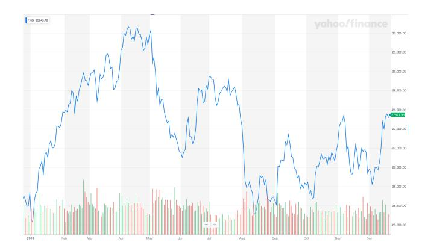

Figure: Hang Seng Index (Source: Yahoo Finance). Like it or not the chart depicts a *random* phenomenon.


| Efficient vs Inefficient Market Hypothesis                                                                                                                                                                                                                                                                                                                                                         |
|----------------------------------------------------------------------------------------------------------------------------------------------------------------------------------------------------------------------------------------------------------------------------------------------------------------------------------------------------------------------------------------------------|
| "There is no way to predict the price of stocks and bonds over the next few days or weeks. But it is quite possible to foresee the broad course of these prices over longer periods, such as the next three to five years. These findings, which might seem both surprising and contradictory, were made and analyzed by this years Laureates, Eugene Fama, Lars Peter Hansen and Robert Shiller." |
| — Press release of The Royal Swedish Academy of Sciences, 14 October 2013.                                                                                                                                                                                                                                                                                                                         |

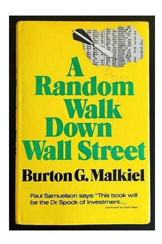

Figure: Burton G. Malkiel, 1973.

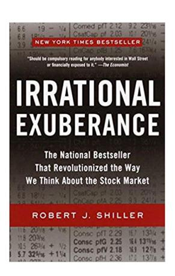

Figure: Robert J. Shiller, 2000.

# Symmetric Random Walk

*•* Let ω be the outcome of tossing a fair coin and let

$$X_j = \begin{cases} 1 & \text{if } \omega_j = \mathsf{H} \text{ (Head),} \ -1 & \text{if } \omega_j = \mathsf{T} \text{ (Tail).} \end{cases}$$

Further let

$$M_k = \sum_{j=1}^k X_j, \quad k = 1, 2, \dots$$

with M<sup>0</sup> = 0. As k (the time index) increases, M<sup>k</sup> goes up or down one unit randomly according to the result of the coin tossing. The sequence Mk, k = 0, 1, 2, . . . , is called a **symmetric random walk**. This is perhaps the simplest example of stochastic processes.

*•* Example: {X<sup>1</sup> = 1, X<sup>2</sup> = −1, X<sup>3</sup> = 1, X<sup>4</sup> = 1, X<sup>5</sup> = −1, X<sup>6</sup> = 1} gives {M<sup>1</sup> = 1, M<sup>2</sup> = 0, M<sup>3</sup> = 1, M<sup>4</sup> = 2, M<sup>5</sup> = 1, M<sup>6</sup> = 2}.

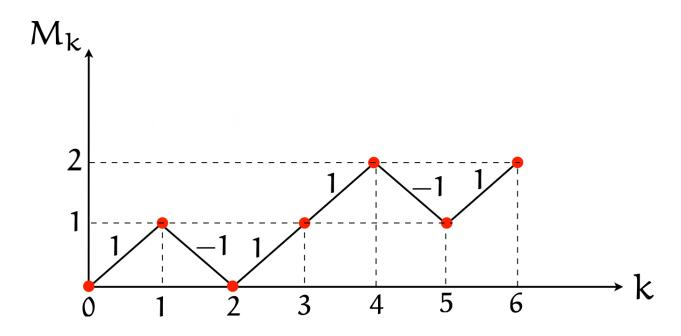

Figure: Symmetric random walk from coin flipping.

*•* Given the integer sequence 0 = k<sup>0</sup> < k<sup>1</sup> < *· · ·* < k<sup>m</sup> where ki+<sup>1</sup> − k<sup>i</sup> may vary with i:

$$\begin{array}{c|ccccccccccccccccccccccccccccccccccc$$

The increment of the random walk, which is a random variable, is defined as

$$M_{k_{i+1}} - M_{k_i} = \sum_{j=k_i+1}^{k_{i+1}} X_j.$$

*•* Example: k<sup>i</sup> = 5 and ki+<sup>1</sup> = 9,

$$M_{k_i} = M_5 = X_1 + X_2 + \dots + X_5 \ \text{ and } \ M_{k_{i+1}} = M_9 = X_1 + X_2 + \dots + X_9.$$

Therefore

$$M_{k_{i+1}} - M_{k_i} = M_9 - M_5 = X_6 + X_7 + \dots + X_9 = \sum_{j=6}^{9} X_j = \sum_{j=k_i+1}^{k_{i+1}} X_j.$$

*•* The expected value of the increment is

$$E[M_{k_{i+1}} - M_{k_i}] = \sum_{j=k_i+1}^{k_{i+1}} \mathbb{E}[X_j] = 0.$$

*•* The variance of X<sup>j</sup> is Var(Xj) = E[X 2 j ] = 1. Since different X<sup>j</sup> are independent,

$$\text{Var}(M_{k_{\mathfrak{i}+1}}-M_{k_{\mathfrak{i}}}) = \sum_{j=k_{\mathfrak{i}}+1}^{k_{\mathfrak{i}+1}} \text{Var}(X_{\mathfrak{j}}) = \sum_{j=k_{\mathfrak{i}}+1}^{k_{\mathfrak{i}+1}} 1 = k_{\mathfrak{i}+1} - k_{\mathfrak{i}}.$$

Hence the variance of the increment increases with the length of the time interval being considered, and is given by l − k for the interval k to l with k ⩾ 0 and k < l.

```
import numpy as np
import matplotlib
import matplotlib.pyplot as plt
for i in [1, 2, 3]:
    M = np.random.randint(1, 3, 100)
    for j in np.arange(len(M)):
        if M[j] == 2:
            M[j] = -1
    for k in np.arange(len(M)-1):
        M[k+1] = M[k] + M[k+1]
    M = np.concatenate([[0], M])
    plt.plot(M)
plt.grid(color='k', linestyle='--', linewidth=0.5)
plt.show()
```

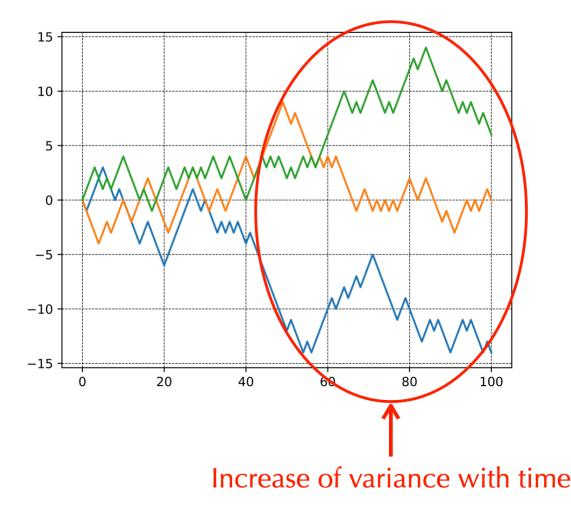

Figure: Simulation examples of symmetric random walk. Note the increase of variance as time increases.

- **Definition.** Let  $X_0, X_1, \ldots, X_k, \ldots$  be a sequence of random variables. The sequence is a **martingale** if
  - 1.  $E[|X_i|] < \infty$  for all i.
  - $\text{2. } E[X_{k+1}\,\big|\,X_0,X_1,\ldots,X_k] = X_k.$

Furthermore, if

$$P(X_{k+1} | X_0, X_1, ..., X_k) = P(X_{k+1} | X_k),$$

the sequence is Markov.

• If a sequence is Markov, then it is also a martingale if

$$E[X_{k+1} \, \big| \, X_k] = X_k.$$

• A game is "fair" if it is a martingale.

C.P. Kwong (Professor Study)

• Let  $M_k$  be a symmetric random walk and  $E[M_l \mid \mathcal{X}_k]$  be the conditional expectation of  $M_l$  based on the result of the first k coin tosses  $\mathcal{X}_k = \{X_0, X_1, \dots, X_k\}$ . Then, by using the properties of conditional expectation, we have

$$\begin{split} \mathsf{E}[\mathsf{M}_1 \, \big| \, \mathfrak{X}_k] &= \mathsf{E}[(\mathsf{M}_1 - \mathsf{M}_k) + \mathsf{M}_k \, \big| \, \mathfrak{X}_k] \\ &= \mathsf{E}[(\mathsf{M}_1 - \mathsf{M}_k) \, \big| \, \mathfrak{X}_k] + \mathsf{E}[\mathsf{M}_k \, \big| \, \mathfrak{X}_k] \quad \text{--- (i)} \\ &= \mathsf{E}[(\mathsf{M}_1 - \mathsf{M}_k) \, \big| \, \mathfrak{X}_k] + \mathsf{M}_k \quad \text{--- (iii)} \\ &= \mathsf{E}[\mathsf{M}_1 - \mathsf{M}_k] + \mathsf{M}_k \quad \text{--- (iii)} \\ &= \mathsf{M}_k. \end{split}$$

- (i) Linearity.
- (ii)  $M_k$  depends only on the first k coin tosses.
- (iii)  $M_l M_k$  is independent of  $\mathfrak{X}_k$ .

The symmetric random walk is a martingale because  $E[M_l \, \big| \, \mathfrak{X}_k] = M_k.$ 

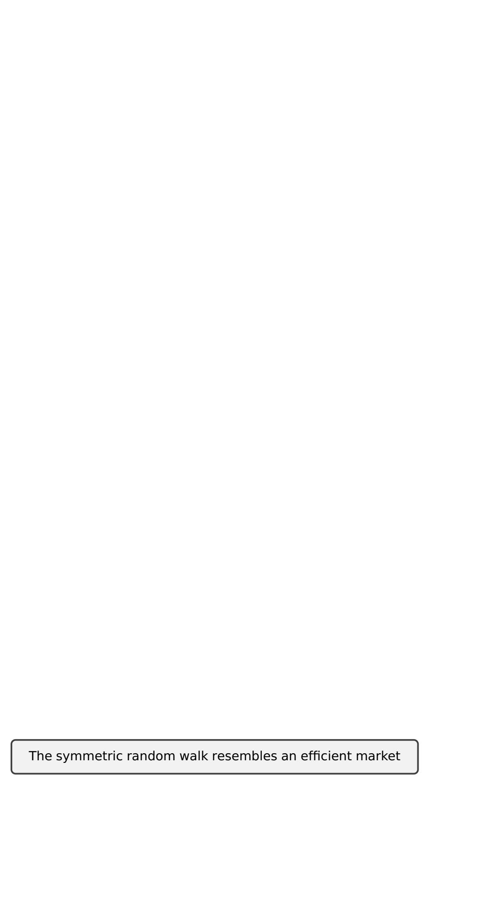

# Scaled Symmetric Random Walk

• Suppose, instead of tossing a coin every second to obtain a symmetric random walk, we toss n times in one second. However, we reduce the step size from 1 to  $\frac{1}{\sqrt{n}}$  at the same time. We call the resulting stochastic process the **scaled symmetric random walk** and write

$$W^{(n)}(t) = \frac{1}{\sqrt{n}} M_{nt}.$$

- The scaled symmetric random walk possesses properties similar to that of the original symmetric random walk.
- Theorem (Central limit). Fix  $t \ge 0$ . As  $n \to \infty$ , the distribution of the scaled random walk  $W^{(n)}(t)$  evaluated at time t converges to the normal distribution with mean zero and variance t.

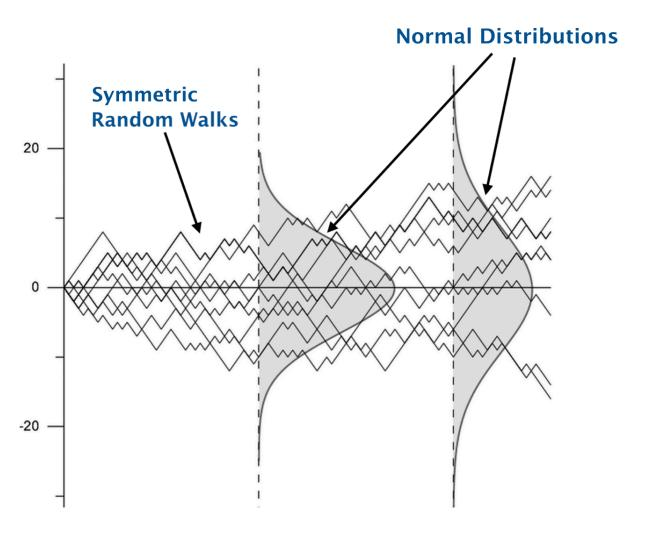

Figure: Distribution of a scaled symmetric random walk approaches normal.

C.P. Kwong (Professor Study) **Asset Price Modeling** 17 / 34

### Brownian Motion

*•* 1827: **Robert Brown** (botanist) discovered random motion of pollen grains in water.

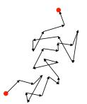

- *•* 1905: **Albert Einstein** (physicist) constructed a diffusion equation model for the Brownian motion.
- *•* 1900: **Louis Bachelier** (mathematician), in his PhD thesis Théorie de la Spéculation, used Brownian motion to model stocks and options.
- *•* 1923: **Norbert Wiener** (mathematician) gave Brownian motion a solid mathematical foundation—the **Wiener process**.

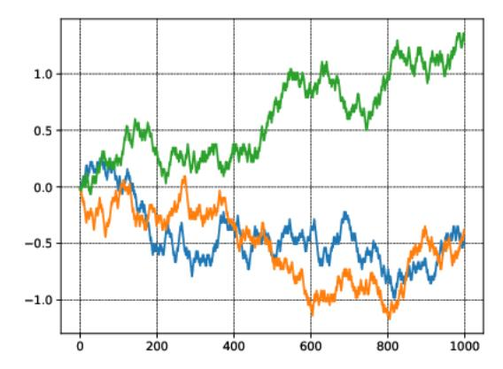

Figure: Simulation examples of Brownian motion.

*•* The Brownian motion is the limiting process of the scaled random walk W(n) (t) when <sup>n</sup> *<sup>→</sup>* <sup>∞</sup>.

**Definition.** A continuous function W(t), t ⩾ 0 is a **Brownian motion** if

- 1. W(0) = 0.
- 2. For all 0 = t<sup>0</sup> < t<sup>1</sup> < *· · ·* < t<sup>m</sup> the increments

$$W(t_1) - W(t_0), W(t_2) - W(t_1), \dots, W(t_m) - W(t_{m-1})$$

are independent and each of these increments is normally distributed with

$$\begin{split} \mathsf{E}[W(\mathsf{t}_{i+1}) - W(\mathsf{t}_i)] &= \mathsf{0}, \\ \mathsf{Var}\left[W(\mathsf{t}_{i+1}) - W(\mathsf{t}_i)\right] &= \mathsf{t}_{i+1} - \mathsf{t}_i. \end{split}$$

• Given  $0 \le s < t$ , we have

$$\begin{split} \mathsf{E}[W(\mathsf{t}) \, \big| \, W(s)] &= \mathsf{E}[(W(\mathsf{t}) - W(s)) + W(s) \, \big| \, W(s)] \\ &= \mathsf{E}[(W(\mathsf{t}) - W(s)) \, \big| \, W(s)] + \mathsf{E}[W(s) \, \big| \, W(s)] \\ &= \mathsf{E}[(W(\mathsf{t}) - W(s)) \, \big| \, W(s)] + W(s) \\ &= \mathsf{E}[W(\mathsf{t}) - W(s)] + W(s) \\ &= W(s). \end{split}$$

Hence Brownian motion is a martingale. That means if an asset is modeled as a Brownian motion, its price today is the best estimate of its price tomorrow. Since this information is known to everybody, the market is fair  $\iff$  Efficient Market Hypothesis.

 Though the asset price cannot be predicted, its past statistics can be computed to help future trading decisions.

### Geometric Brownian Motion

*•* Let S(t) be the price of an asset at time t and it changes to S(t) + dS(t) at t + dt where dt is an infinitesimal increase in time. Then the instantaneous return of the asset is dS(t)/S(t). We model this return as composing of two parts, one is deterministic or predictable, given by

α dt

and the other a random term governed by a Brownian motion:

σ dW(t).

Here α is called **drift** that measures the average return of the asset, say interest earned by investing a risk-free bond. The term σ is called the **volatility** of the asset. Both α and σ can be constant or time-varying (and random).

Hence we have

$$\frac{dS(t)}{S(t)} = \alpha dt + \sigma dW(t),$$

a stochastic differential equation, called the **geometric Brownian motion**, of which the solution is

$$S(t) = S(0) \exp \left\{ \sigma W(t) + \left(\alpha - \frac{1}{2}\sigma^2\right) t \right\}$$

where S(0) is the initial asset price.

• In the geometric Brownian motion model the volatility  $\sigma$  is a statistical parameter. However, given a realization (path) of the process, we are able to estimate this important parameter as follows. Let  $[T_1,T_2]$  be the interval we take observation of S(t). Partition this interval as  $T_1=t_0< t_1< \cdots < t_m=T_2$ . Then the **log return** measured for the subinterval  $[t_j,t_{j+1}]$  is

$$\log \frac{S(t_{j+1})}{S(t_{j})} = \sigma(W(t_{j+1}) - W(t_{j})) + \left(\alpha - \frac{1}{2}\sigma^{2}\right)(t_{j+1} - t_{j}).$$

The sum of the squares of the log returns, i.e.,

$$\sum_{j=0}^{m-1} \left(\log \frac{S(t_{j+1})}{S(t_j)}\right)^2,$$

is called the realized volatility.

It can be shown that, when the partition of [T1, T2] is getting very fine, i.e.,

$$\max_{j=0,1,...,m-1} (t_{j+1} - t_j) \approx 0$$
 ,

we have

$$\frac{1}{T_2-T_1}\sum_{j=0}^{m-1}\left(\log\frac{S(t_{j+1})}{S(t_j)}\right)^2\approx\sigma^2.$$

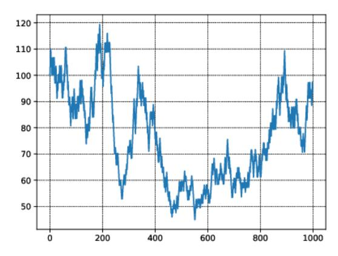

Figure: Geometric Brownian motion with σ = 1.0, α = 0.6.

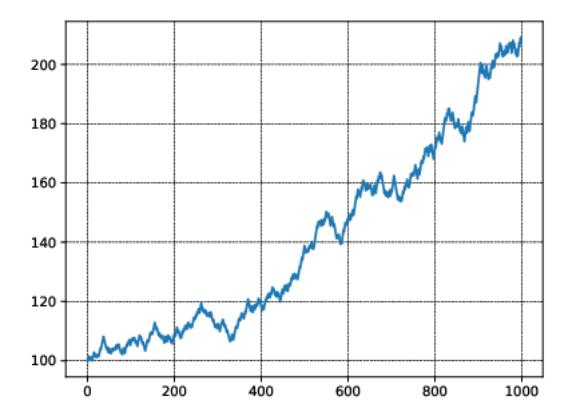

Figure: Geometric Brownian motion with σ = 0.2, α = 0.6.

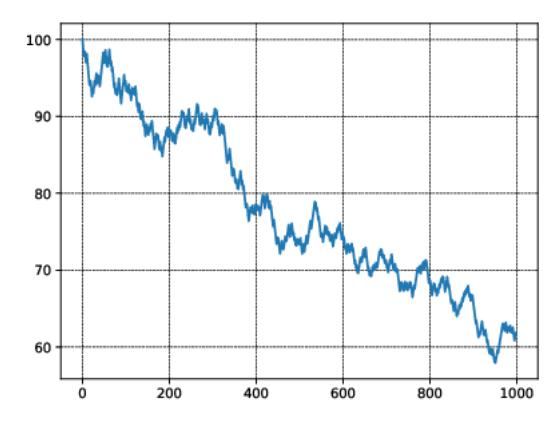

Figure: Geometric Brownian motion with σ = 0.2, α = −0.6.

### Other Models

- *•* Jumps of price frequently found in stocks, commodities, or currency pairs. They are due to, for example, an unexpected change of the CEO of a company, reduction of oil output suddenly announced by a key oil supply country, or increase of interest rate after a meeting of a central bank.
- *•* To model these jumps we may assume that they occur randomly but follow a **Poisson process** (a model to describe, say, the arrival time of a taxi). We also assume, before and after a jump, the asset price still evolves according to a geometric Brownian motion (GBM). This combination of Poisson process and GBM is called a **jump diffusion process**.

# Price Jump

*•* Abrupt jumps in asset price are not uncommon (e.g., triggered by unexpected financial news).

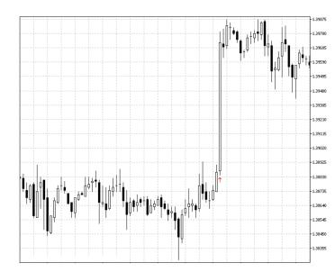

*•* Before and after the jumps, the price may still follow a Brownian motion.

# Jump Diffusion Model

*•* The geometric Brownian motion (GBM) is the stochastic differential equation

$$\frac{dS(t)}{S(t)} = \alpha dt + \sigma dW(t)$$

where W(t) is a Brownian motion.

*•* The basic **jump diffusion model** (by Merton) is the combination of a jump process and a GBM:

$$\frac{dS(t)}{S(t)} = \alpha dt + \sigma dW(t) + (\mathbf{J_k - 1})\delta_{t_k}, \quad \mathbf{k} = \mathbf{1, 2, ...}$$

where (J<sup>k</sup> − 1)δt<sup>k</sup> is an impulse function at t<sup>k</sup> producing a finite jump from S to S Jk.

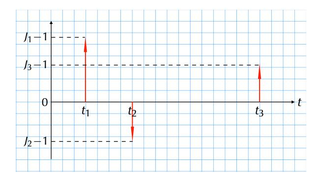

*•* "Diffusion" because Brownian motion underlies the physical phenomenon of diffusion.

# Jump Statistics

*•* Assume that the random number of jumps X during a fixed time interval follows a **Poisson distribution**

$$f(x) = \frac{\mu^x}{x!}e^{-\mu}, \quad x = 0, 1, 2, \dots$$

where µ is the mean value of X. Then we can calculate the probability of having n jumps in a given time interval.

Example: The mean number of jumps in one day for the currency pair USD/JPY is 6. What is the probability that there are more than 12 jumps in the next 3 days ?

We have µ = 6 *×* 3 = 18. The required probability is

$$P(X > 12) = 1 - P(X \le 12) = 1 - [P(X = 0) + P(X = 1) + \dots + P(X = 12)]$$

$$= 1 - [\frac{18^{0}}{0!}e^{-18} + \frac{18^{1}}{1!}e^{-18} + \dots + \frac{18^{12}}{12!}e^{-18}]$$

$$= 0.9083$$