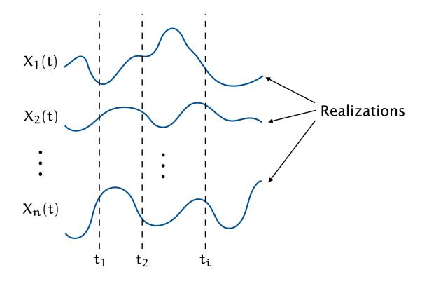
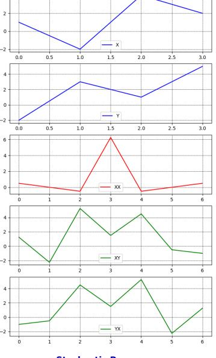
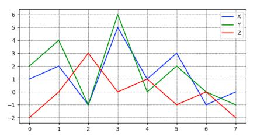
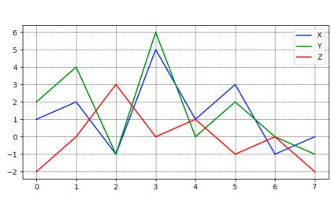

### **Stochastic Processes**

C.P. Kwong

Professor Study

C.P. Kwong (Professor Study) **Stochastic Processes** 1 / 21

### Stochastic Processes

- *•* Asset prices are modeled as **stochastic processes**, such as Brownian motion.
- *•* Stochastic processes are *time-indexed* random variables. The time index can be continuous or discrete.
- *•* Analysis of stochastic processes prevails in quantitative finance.

*•* A stochastic process is an **ensemble** of functions called the **realizations** of the process:

Figure: Ensemble of realizations.

## Stationarity

- *•* At t1, the values of X1(t), X2(t), *· · ·* , Xn(t) are sample values of a random variable with probability density f[x(t1)]. In the most general case f is a function of time, i.e., f[x(ti)] *̸*= f[x(tj)] if ti *̸*= tj .
- *•* If, for *any* t1 and h satisfying −T/2 ⩽ t1, t1 + h ⩽ T/2,

$$f[x(t_1)] = f[x(t_1 + h)],$$

then the process is said to be **stationary to order one** in [−T/2, T/2].

*•* The process is **stationary to order** n in [−T/2, T/2] if the joint probability density has the property that

$$f[x(t_1), x(t_2), ..., x(t_n)] = f[x(t_1 + h), x(t_2 + h), ..., x(t_n + h)]$$

for *any* ti and h satisfying −T/2 ⩽ ti, ti + h ⩽ T/2, i = 1, 2, . . . , n.

C.P. Kwong (Professor Study) **Stochastic Processes** 4 / 21

### Mean and Correlation

*•* The **mean** of a stochastic process is defined as

$$E[X(t_i)],$$

which is a constant if the process is stationary to order one.

*•* The **autocorrelation function** is defined as

$$R(t_1, t_2) = E[X(t_1)X(t_2)].$$

For a process that is stationary to order two, we have

$$R(t_1,t_2) = E[X(t_1+h)X(t_2+h)] = R(t_1+h,t_2+h).$$

In this case, the autocorrelation function depends only on the time difference t2 − t1, i.e.,

$$R(t_1, t_2) = R(t_2 - t_1) = R(\tau).$$

### Wide-Sense Stationary Processes

- *•* A process is **wide-sense stationary** if
  - 1. E[X(ti)] = constant for all ti.
  - 2. E[X(t1)X(t2)] = R(t2 − t1) = R(τ) for all t1 and t2. This leads to R(τ) = E[X(t)X(t + τ)] for all t.

Wide-sense stationarity is a useful assumption that simplifies analysis.

*•* A process that is stationary to order two is clearly wide-sense stationary. However, the converse may *not* be true since wide-sense stationarity does not pose any requirement on the joint density function.

*•* A wide-sense stationary process has the following properties:

1.

$$R(0) = E[X^2(t)].$$

2.

$$R(-\tau) = E[X(t)X(t-\tau)].$$

Let t − τ = λ, then R(−τ) = E[X(λ + τ)X(λ)]. It follows that

$$R(-\tau) = R(\tau),$$

i.e., R(τ) is an *even* function.

3. Since E[{X(t) *±* X(t + τ)} 2 ] ⩾ 0, then

$$\mathsf{E}[X^2(t)] + \mathsf{E}[X^2(t+\tau)] \pm 2\mathsf{E}[X(t)X(t+\tau)] \geqslant 0.$$

This gives 2R(0) *±* 2R(τ) ⩾ 0, or

$$R(0) \geqslant |R(\tau)|.$$

# Cross Correlation and Jointly Wide-Sense Stationary

*•* Let X(t) and Y(t) be two stochastic processes with, respectively, autocorrelation functions RXX(t1, t2) and RYY(t1, t2). We can define two **cross-correlation functions** as

$$R_{XY}(t_1,t_2) = E[X(t_1)Y(t_2)]$$

and

$$R_{YX}(t_1, t_2) = E[Y(t_1)X(t_2)].$$

*•* If the processes are each wide-sense stationary and furthermore

$$R_{XY}(t_1, t_2) = R_{XY}(t_2 - t_1) = R_{XY}(\tau)$$

and

$$R_{YX}(t_1, t_2) = R_{YX}(t_2 - t_1) = R_{YX}(\tau),$$

then the processes are said to be **jointly wide-sense stationary**.

*•* If X(t) and Y(t) are two jointly wide-sense stationary processes, we have:

1.

$$R_{XY}(0) = R_{YX}(0) = E[X(t)Y(t)].$$

2.

$$R_{XY}(-\tau) = E[X(t)Y(t-\tau)].$$

Let t − τ = λ, then RXY(−τ) = E[X(λ + τ)Y(λ)]. It follows that

$$R_{XY}(-\tau) = R_{YX}(\tau).$$

3. Since

$$\label{eq:energy} \mathsf{E}\left[\left\{\frac{X(t)}{\sqrt{R_{XX}(0)}}\pm\frac{Y(t+\tau)}{\sqrt{R_{YY}(0)}}\right\}^2\right]\geqslant 0,$$

then 
$$\frac{R_{XX}(0)}{R_{XX}(0)} + \frac{R_{YY}(0)}{R_{YY}(0)} \pm 2 \frac{R_{XY}(\tau)}{\sqrt{R_{XX}(0)R_{YY}(0)}} \geqslant 0,$$
 or 
$$2 \pm 2 \frac{R_{XY}(\tau)}{\sqrt{R_{XX}(0)R_{YY}(0)}} \geqslant 0,$$
 or 
$$\sqrt{R_{XX}(0)R_{YY}(0)} \geqslant |R_{XY}(\tau)|.$$

# Time Averages and Ergodicity

- *•* In practice only *one* realization of an ensemble is observed. Can we work on the various **time averages** of a realization instead of the statistical averages of the ensemble? Define
  - 1. **Time Average** = lim T*→*∞ 1 T ∫ T/2 −T/2 X(t) dt.
  - 2. **Time Autocorrelation Function** = lim T*→*∞ 1 T ∫ T/2 −T/2 X(t)X(t + τ) dt.
  - 3. **Time Cross-Correlation Function** = lim T*→*∞ 1 T ∫ T/2 −T/2 X(t)Y(t + τ) dt.
- *•* A stochastic process is said to be **ergodic** if time averages are equal to their respective statistical averages.

### Computing Time Averages

- *•* In finance practice a stochastic process X(t) usually takes the form of a sequence of time-ordered random numbers X0, X1, . . . , XN−1, for instance the tick-by-tick exchange rate of Euro against USD. Then the integrals in the defined time averages become summations.
  - 1. Mean:

$$\mu_X = \frac{1}{N} \sum_{i=0}^{N-1} X_i.$$

2. Autocorrelation Function:

$$R_{XX}(k) = \frac{1}{N} \sum_{i=0}^{N-1+k} X_{i+k} X_i, \label{eq:RXX}$$

$$k = -(N-1), \ldots, -2, -1, 0, 1, 2, \ldots, (N-1).$$

C.P. Kwong (Professor Study) **Stochastic Processes** 13 / 21

3. Cross-Correlation Function:

$$R_{XY}(k) = \frac{1}{N} \sum_{i=0}^{N-1+k} X_{i+k} Y_i. \label{eq:RXY}$$

$$k = -(N-1), \ldots, -2, -1, 0, 1, 2, \ldots, (N-1).$$

*•* Example: Given {X} = {1, −2, 4, 2} and {Y} = {−2, 3, 1, 5}.

$$\mu_X = 1.25$$
.

$$R_{XX} = \{0.5, 0, -0.5, 6.25, -0.5, 0, 0.5\}.$$

$$R_{XY} = \{1.25, -2.25, 5.25, 1.5, 4.5, -0.5, -1\}.$$

$$R_{YX} = \{-1, -0.5, \ 4.5, \ 1.5, \ 5.25, -2.25, \ 1.25\}.$$

*•* The term of RXX(k) corresponding to k = 0:

$$R_{XX}(0) = \frac{1}{N} \sum_{i=0}^{N-1} X_i X_i,$$

is called the **autocorrelation** of X.

*•* The term of RXY(k) corresponding to k = 0:

$$R_{XY}(0) = \frac{1}{N} \sum_{i=0}^{N-1} X_i Y_i,$$

is called the **cross-correlation** of X and Y.

### *•* Example: Given

$$X = \{1, 2, -1, 5, 1, 3, -1, 0\},\$$
  
 $Y = \{2, 4, -1, 6, 0, 2, 0, -1\},\$   
 $Z = \{-2, 0, 3, 0, 1, -1, 0, -2\}.$ 

We have RXY(0) = 5.875 and RXZ(0) = −0.875. Hence |RXY(0)| > |RXZ(0)|. Furthermore, X is *negatively* correlated with Z.

### Covariance Matrix

*•* When comparing two sequences for similarity in variations their mean values are immaterial. We then modify the cross-correlation to

$$\mathsf{Cov}(X,Y) = \sigma_{X,Y} = \frac{1}{N} \sum_{i=0}^{N-1} (X_i - \mu_X)(Y_i - \mu_Y),$$

called the **covariance** of X and Y. In case Y = X, we call

$$\sigma_X^2 = \sigma_{X,X} = \frac{1}{N} \sum_{i=0}^{N-1} (X_i - \mu_X)(X_i - \mu_X)$$

the **variance** of X and σX = √ σ 2 X its **standard deviation**.

C.P. Kwong (Professor Study) **Stochastic Processes** 18 / 21

Furthermore, the covariance of X and Y normalized by their respective standard deviations is referred to the **correlation**  $\rho_{X,Y}$  of X and Y:

$$\rho_{X,Y} = \frac{\text{Cov}(X,Y)}{\sigma_X \sigma_Y}.$$

• Given asset prices  $S_i, \ i=1,2,\ldots,n,$  we may form their **covariance** matrix

$$\Sigma = \begin{bmatrix} \sigma_1^2 & \sigma_{1,2} & \cdots & \sigma_{1,n} \\ \sigma_{2,1} & \sigma_2^2 & \cdots & \sigma_{2,n} \\ \vdots & & \ddots & \vdots \\ \sigma_{n,1} & \cdots & & \sigma_n^2 \end{bmatrix}$$

#### and correlation matrix

$$\Gamma = \begin{bmatrix} 1 & \rho_{1,2} & \cdots & \rho_{1,n} \\ \rho_{2,1} & 1 & \cdots & \rho_{2,n} \\ \vdots & & \ddots & \vdots \\ \rho_{n,1} & \cdots & & 1 \end{bmatrix}.$$

Note that we write, for simplicity,  $\sigma_{1,2}$  for  $\sigma_{S_1,S_2}$  and  $\rho_{1,2}$  for  $\rho_{S_1,S_2}$  and so on. Furthermore,  $\Sigma$  and  $\Gamma$  are **symmetric** matrices since  $\sigma_{i,j}=\sigma_{j,i}$  (and hence  $\rho_{i,j}=\rho_{j,i}$ ) for all  $i,j=1,2,\ldots,n,\ i\neq j$ . The matrices play signification roles in constructing portfolios with multiple assets.

*•* Example: Given

$$X = \{1, 2, -1, 5, 1, 3, -1, 0\},\$$
  
 $Y = \{2, 4, -1, 6, 0, 2, 0, -1\},\$   
 $Z = \{-2, 0, 3, 0, 1, -1, 0, -2\}.$ 

We have 
$$\Sigma = \begin{bmatrix} \sigma_X^2 & \sigma_{X,Y} & \sigma_{X,Z} \\ \sigma_{Y,X} & \sigma_Y^2 & \sigma_{Y,Z} \\ \sigma_{Z,X} & \sigma_{Z,Y} & \sigma_Z^2 \end{bmatrix} = \begin{bmatrix} 3.688 & 4.0 & -0.719 \\ 4.0 & 5.5 & -0.688 \\ -0.719 & -0.688 & 2.359 \end{bmatrix}.$$